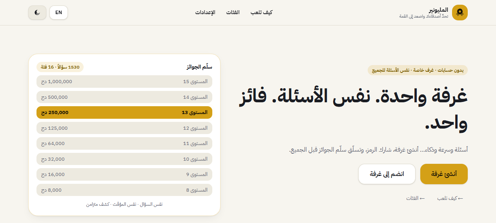
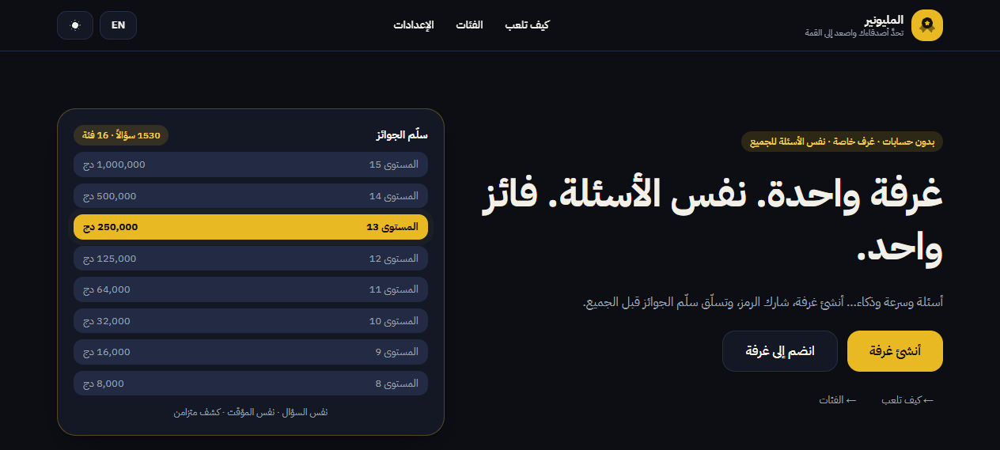
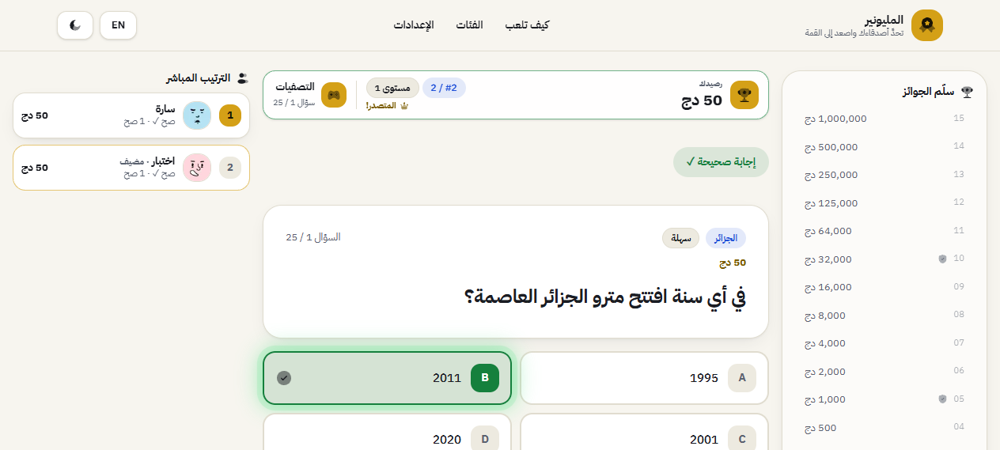
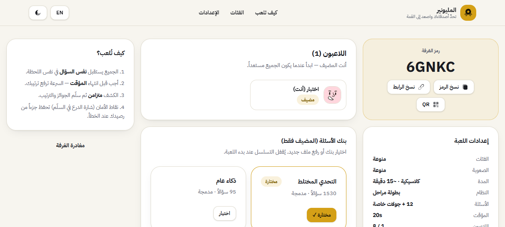

# المليونير — Millionaire Party

لعبة مسابقات جماعية لحظية بهوية أصلية: أنشئ غرفة، شارك رمزاً قصيراً، أجيبوا على **نفس الأسئلة** تحت **نفس المؤقت**، وتسلّقوا **سلّم الجوائز** — بلا حسابات، بلا تسجيل، بلا backend.




## الفكرة في 30 ثانية

- **دخول بلا حساب**: اسم مؤقت + صورة رمزية داخل الغرفة فقط.
- **المضيف** يضبط (الفئات، الصعوبة، المدة، البطولة، البنك) ويبدأ.
- **الجميع** يستقبل نفس السؤال والخيارات الأربعة مع نفس العدّاد.
- **الكشف متزامن** مع الشرح، ثم الرصيد والترتيب والسؤال التالي.
- **الفائز** هو الأعلى رصيداً بعد النهائي — مع إحصائيات وإعادة فورية.

## التشغيل

```bash
npm install
npm run dev        # http://localhost:3000
npm run typecheck  # فحص الأنواع
npm run test       # الاختبارات (vitest)
npm run lint       # فحص الأسلوب + حارس الأيقونات
npm run build      # بناء الإنتاج
```

> القاعدة الذهبية: لا commit ما لم تكن `typecheck + test + build + lint` خضراء.

## رحلة اللعب

| الخطوة | المسار | الوصف |
|---|---|---|
| إنشاء | `/create` | الاسم + الصورة + المدة (سريعة/كلاسيكية/ماراثون) + البطولة + البنك + الاتصال |
| انضمام | `/join` أو `/join/CODE` | الاسم + الصورة + الرمز (نسخ/رابط/QR) |
| الردهة | `/room/CODE` | الاستعداد، إدارة البنوك (مضيف)، لاعبون افتراضيون، قفل الغرفة |
| اللعب | `/room/CODE/game` | سؤال + مؤقت + lifelines + سلّم + ترتيب مباشر + مراحل البطولة |
| النتائج | `/room/CODE/results` | التتويج (confetti + عدّاد)، الترتيب، الإحصائيات، إعادة اللعب |




## المحتويات

- **1530 سؤالاً عربياً** عبر 16 فئة (علوم، تاريخ، الجزائر، الأمازيغية، شمال إفريقيا، الشرق الأوسط…) — انظر [`docs/03-questions.md`](docs/03-questions.md)
- **36 صورة رمزية** CC0 تعمل دون إنترنت + **أيقونات Solar** (BoldDuotone) حصرياً — انظر [`docs/05-design.md`](docs/05-design.md)
- **بطولة مراحل**: تصفيات ← سرعة ⚡ ← نصف نهائي ← رهان ← نهائي — انظر [`docs/02-gameplay.md`](docs/02-gameplay.md)
- **صوت WebAudio مُصنّع + اهتزاز + وضع هادئ** — انظر [`docs/06-audio-fx.md`](docs/06-audio-fx.md)
- **P2P بلا سيرفر** (Trystero) والمضيف هو المرجع — انظر [`docs/04-multiplayer.md`](docs/04-multiplayer.md)

## البنية باختصار

```
src/app/            ← المسارات (create/join/room/[code]/{game,results}/settings/…)
src/components/
  game/             ← QuestionCard, Timer, PrizeLadder, Leaderboard, MatchStatusBar, StageFx…
  room/             ← RoomCode, BankManager…
  ui/               ← Button, Card, Badge, GameIcon (Solar), Avatar (PNG)…
src/lib/
  game/             ← types.ts, engine.ts (منطق نقي قابل للاختبار), store.ts (Zustand)
  bank/             ← validate.ts, parse.ts (XLSX/CSV/JSON)
  fx/               ← audio.ts (WebAudio), haptics.ts
  net/              ← p2p.tsx (Trystero)
src/data/questions/ ← 19 ملفاً (1530 سؤالاً) + index.ts + dataset.test.ts
src/i18n/           ← عربي (RTL افتراضي) + إنجليزي (LTR)
```

التفاصيل: [`docs/01-overview.md`](docs/01-overview.md) و[`docs/07-development.md`](docs/07-development.md).

## النشر (Vercel)

اربط الريبو من لوحة Vercel (Import) — الإعدادات تُكتشف تلقائياً (Next.js + `npm run build`)، ولا متغيرات بيئة مطلوبة. كل push إلى `master` يعيد النشر. التفاصيل والأخطاء الشائعة (مثل ERESOLVE): [`docs/07-development.md`](docs/07-development.md).

## التوثيق الكامل

- [`docs/01-overview.md`](docs/01-overview.md) — النظرة العامة والمفاهيم
- [`docs/02-gameplay.md`](docs/02-gameplay.md) — المدد والمراحل والرهان والسرعة
- [`docs/03-questions.md`](docs/03-questions.md) — البنوك والجودة والاستيراد
- [`docs/04-multiplayer.md`](docs/04-multiplayer.md) — الشبكة والعدالة والأطوار
- [`docs/05-design.md`](docs/05-design.md) — الثيمات والأيقونات والصور
- [`docs/06-audio-fx.md`](docs/06-audio-fx.md) — الصوت والاهتزاز والمؤثرات
- [`docs/07-development.md`](docs/07-development.md) — التطوير والجودة والنشر
- [`CHANGELOG.md`](CHANGELOG.md) — سجل كل الخطوات حتى v1.0.0
- [`CONTRIBUTING.md`](CONTRIBUTING.md) — كيف تساهم (بما فيها العمل المشترك)

## الحقوق

- الصور الرمزية: 36 صورة (12 وجوه محايدة + 20 نساء/محجبات/أطفال/كبار سن + 4 رجال ملتحين) بأنماط Notionists وLorelei وOpen Peeps — ملكية عامة CC0 1.0، ملفات PNG محفوظة محلياً في `public/avatars/` لتعمل اللعبة دون إنترنت. إعادة التوليد: `node scripts/generate-avatars.mjs`.
- الأيقونات: Solar Icons (عائلة Bold Duotone) عبر حزمة `solar-icon-set`.
- الهوية أصلية بالكامل — مفهوم سلّم الجوائز فقط كمفهوم عام، بلا نسخ لأي علامة تلفزيونية.
